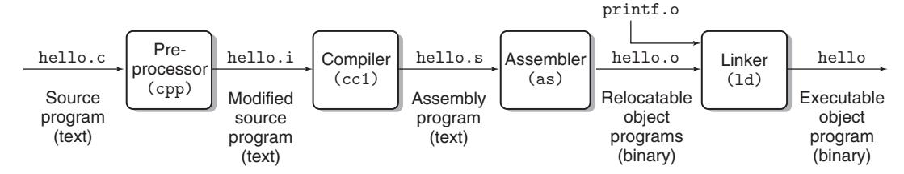

# 1.2 Programs Are Translated by Other Programs into Different Forms

The `hello` program begins life as a high-level C program because it can be read and understood by human beings in that form. However, to run `hello.c` on the system, the individual C statements must be translated by other programs into a sequence of low-level **machine-language instructions**. These instructions are then packaged in a form called an **executable object program** and stored as a binary disk file.

## The Compilation System

On a Unix system, the translation from source file to object file is performed by a **compiler driver**:

```bash
linux> gcc -o hello hello.c
```



**Figure 1.3 — The compilation system**

The GCC compiler driver reads the source file `hello.c` and translates it into an executable object file `hello`. The translation is performed in **four phases**:

### 1. Preprocessing Phase

The **preprocessor** (`cpp`) modifies the original C program according to directives that begin with `#`. For example, `#include <stdio.h>` tells the preprocessor to read the contents of the system header file `stdio.h` and insert it directly into the program text. The result is another C program, typically with the `.i` suffix.

### 2. Compilation Phase

The **compiler** (`cc1`) translates the text file `hello.i` into the text file `hello.s`, which contains an **assembly-language program**. Assembly language provides a common output language for different compilers for different high-level languages (e.g., C and Fortran compilers both generate the same assembly language).

```assembly
main:
    subq    $8, %rsp
    movl    $.LCO, %edi
    call    puts
    movl    $0, %eax
    addq    $8, %rsp
    ret
```

Each line describes one low-level machine-language instruction in textual form.

### 3. Assembly Phase

The **assembler** (`as`) translates `hello.s` into machine-language instructions, packages them in a form known as a **relocatable object program**, and stores the result in the object file `hello.o`. This is a binary file containing 17 bytes to encode the instructions for `main`. Viewed with a text editor, it would appear as gibberish.

### 4. Linking Phase

The `hello` program calls the `printf` function, which is part of the **standard C library**. The `printf` function resides in a separate precompiled object file called `printf.o`. The **linker** (`ld`) merges `printf.o` with `hello.o`. The result is the `hello` file, which is an **executable object file** (or simply **executable**) ready to be loaded into memory and executed.

---

### Aside: The GNU Project

GCC is one of many useful tools developed by the **GNU** (GNU's Not Unix) project, started by **Richard Stallman** in 1984. The goal was to develop a complete Unix-like system whose source code is unencumbered by restrictions.

The GNU environment includes:
- `emacs` editor
- `gcc` compiler (supports C, C++, Fortran, Java, Pascal, Objective-C, Ada)
- `gdb` debugger
- Assembler, linker, and utilities for manipulating binaries

The modern open-source movement (commonly associated with Linux) owes its intellectual origins to the GNU project's notion of **free software** ("free" as in "free speech," not "free beer").
