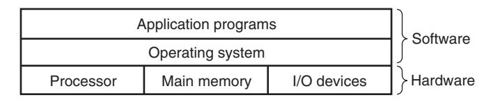
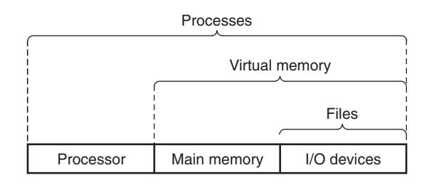
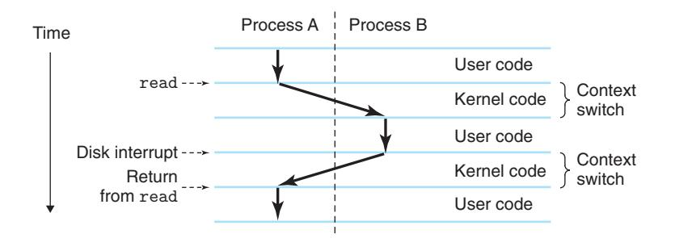
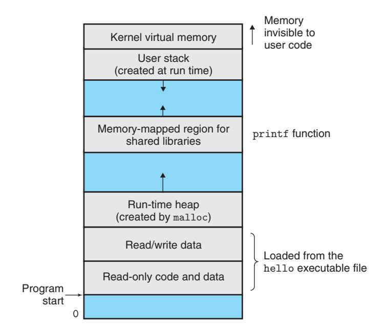

# 1.7 The Operating System Manages the Hardware

When the shell loaded and ran the `hello` program, and when `hello` printed its message, neither program accessed the keyboard, display, disk, or main memory directly. Instead, they relied on the services provided by the **operating system**.

**Figure 1.10 — Layered view of a computer system**

The operating system is a layer of software interposed between the application program and the hardware. All attempts by an application program to manipulate the hardware must go through the operating system.

## Two Primary Purposes of the OS

1. **Protect** the hardware from misuse by runaway applications
2. **Provide** applications with simple and uniform mechanisms for manipulating complicated and often wildly different low-level hardware devices

## Three Fundamental Abstractions

**Figure 1.11 — Abstractions provided by an operating system**

| Abstraction | What It Abstracts |
|-------------|-------------------|
| **Processes** | Processor, main memory, and I/O devices |
| **Virtual memory** | Main memory and disk I/O devices |
| **Files** | I/O devices |

## 1.7.1 Processes

When a program runs on a modern system, the operating system provides the illusion that the program is the only one running. This illusion is provided by the notion of a **process** — one of the most important and successful ideas in computer science.

A **process** is the operating system's abstraction for a running program. Multiple processes can run **concurrently** on the same system, where the instructions of one process are interleaved with the instructions of another.

### Context Switching

The operating system performs this interleaving with a mechanism known as **context switching**.

The **context** includes all state information the process needs to run:
- Current values of the PC (program counter)
- The register file
- Contents of main memory

**Figure 1.12 — Process context switching**

In the `hello` example scenario, there are two concurrent processes: the **shell process** and the **hello process**.

1. Initially, the shell is running alone, waiting for input
2. When we ask it to run `hello`, the shell invokes a **system call** that passes control to the operating system
3. The OS saves the shell's context, creates the `hello` process and its context, and passes control to it
4. After `hello` terminates, the OS restores the shell's context and passes control back

### The Kernel

The **kernel** is the portion of the operating system code that is always resident in memory. When an application program requires an OS action (e.g., to read/write a file), it executes a special **system call** instruction, transferring control to the kernel. The kernel is not a separate process — it is a collection of code and data structures that the system uses to manage all processes.

---

### Aside: Unix, Posix, and the Standard Unix Specification

In 1969, Bell Labs researchers — **Ken Thompson**, **Dennis Ritchie**, **Doug McIlroy**, and **Joe Ossanna** — began work on a simpler operating system for a PDP-7 computer. In 1970, Brian Kernighan dubbed it "Unix" as a pun on "Multics." The kernel was rewritten in C in 1973.

**Key milestones:**
- **Late 1970s–1980s:** UC Berkeley added virtual memory and Internet protocols (BSD versions)
- **Mid 1980s:** IEEE sponsored the **Posix** standardization effort to combat incompatible Unix versions
- **Modern day:** A unified Standard Unix Specification exists, combining Posix with other standards

---

## 1.7.2 Threads

In modern systems, a process can actually consist of multiple execution units called **threads**, each running in the context of the process and sharing the same code and global data.

**Why threads matter:**
- They provide concurrency for network servers
- It is easier to share data between multiple threads than between multiple processes
- Threads are typically more efficient than processes
- Multi-threading enables programs to run faster when multiple processors are available

## 1.7.3 Virtual Memory

**Virtual memory** is an abstraction that provides each process with the illusion that it has exclusive use of main memory. Each process has the same uniform view of memory, known as its **virtual address space**.

**Figure 1.13 — Process virtual address space**

### Virtual Address Space Layout (Linux)

| Region | Description |
|--------|-------------|
| **Program code and data** | Fixed size once process begins; initialized from executable object file |
| **Heap** | Expands/contracts dynamically via `malloc` and `free` |
| **Shared libraries** | Holds code/data for libraries like the C standard library and math library |
| **User stack** | Expands/contracts dynamically during function calls |
| **Kernel virtual memory** | Top region reserved for kernel; application programs cannot read/write here |

The basic idea of virtual memory is to store the contents of a process's virtual memory on disk and use main memory as a cache for the disk.

## 1.7.4 Files

A **file** is a sequence of bytes — nothing more and nothing less. Every I/O device (disks, keyboards, displays, even networks) is modeled as a file. All input and output in the system is performed by reading and writing files, using a small set of system calls known as **Unix I/O**.

This simple and elegant notion of a file is powerful because it provides applications with a **uniform view** of all the varied I/O devices in the system, allowing the same program to run on different systems with different disk technologies.

---

### Aside: The Linux Project

In August 1991, **Linus Torvalds**, a Finnish graduate student, announced a new Unix-like operating system kernel:

> *"Hello everybody out there using minix — I'm doing a (free) operating system (just a hobby, won't be big and professional like gnu) for 386(486) AT clones."*

By combining forces with the GNU project, Linux has developed into a complete, Posix-compliant Unix operating system, available on everything from handheld devices to mainframe computers.
